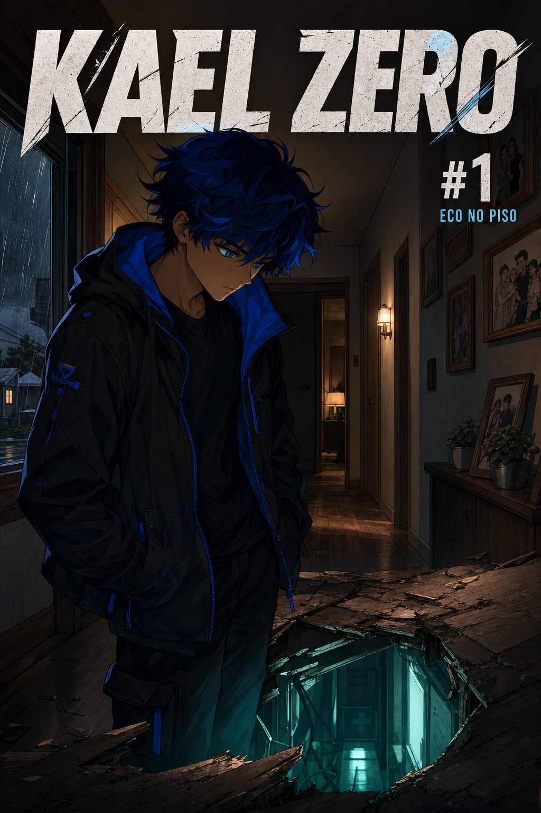

# KAEL ZERO
## Revista Nº 1 — ECO NO PISO  
### (v1.3 — abertura para leitor novo + lettering profissional)

**Páginas:** 24 + capa  
**Princípio:** o leitor não sabe nada; cada página ensina uma peça.  
**Lettering:** balões no topo / gutter; **nunca** cobrem rostos (`12_LETTERING.md`).

---

---

# A HISTÓRIA

---

## PÁGINA 1 — A casa, à tarde

**Quadro 1 — Wide.** Rua comum. Casa de classe média. Sol baixo. Nenhum neon, nenhuma fantasia.  
**Legenda:** `PORT HAVEN`

**Quadro 2.** Helena Zero sobe a calçada ainda de jaleco. Médica. Cansaço no ombro. Chave na mão.

**HELENA:**  
Adrian?  
Cheguei cedo hoje.

**Quadro 3.** Porta entreaberta. Silêncio demais.

**Quadro 4.** Quarto. Adrian na cama. Quieto. Errado.

**Quadro 5.** Close na mão dele — fria. Helena não grita. Ainda.

**Quadro 6.** No travesseiro, um bilhete.

> *Eu tentei de tudo...*

---

## PÁGINA 2 — O que sobrou

**Quadro 1.** Helena lê o bilhete. A mão treme.

**Quadro 2.** Na porta do quarto, Kael — 10 anos, cabelo azul — encara a cama. Não entende. Não chora. Ainda.

**KAEL:**  
Mãe…?  
O pai tá dormindo?

**Quadro 3.** Helena se ajoelha na frente dele. Esconde o bilhete atrás das costas.

**HELENA:**  
Vem.  
Fica comigo.

**Quadro 4.** Wide da casa à noite. Luz da sala acesa.  
**Legenda:**  
Oficialmente, a causa nunca ficou clara.  
Na vizinhança, alguém murmurou suicídio.  
Helena não discutiu. Só trabalhou.

**Quadro 5.** Match cut: olho do menino → olho de Kael aos 16.  
**Legenda:** `SEIS ANOS DEPOIS`

---

## PÁGINA 3 — Um garoto comum (de verdade)

**Quadro 1 — Wide.** Port Haven de dia: escola, mar ao longe, trânsito normal. Cidade que parece qualquer uma.

**Legenda:**  
Kael Zero tem dezesseis anos.  
Anda de skate. Conserta o que quebra.  
Não é popular. Não treina luta. Não é herói.

**Quadro 2.** Skate no asfalto molhado. Escola ao fundo.

**SFX:** *KRRRASH*

**Quadro 3.** Kael no chão, ri sozinho. Espaço **acima da cabeça** limpo (zona de balão).

**KAEL:**  
Ai…  
Tá. Quase.

**Quadro 4.** Ele se levanta, sacode a jaqueta. Olha a escola como quem encararia mais um dia igual.

**KAEL:**  
Beleza. Mais um dia sem incendiar nada.

---

## PÁGINA 4 — Amigos, e o buraco onde o pai estava

**Quadro 1.** Ryo no portão (esquerda). Kael (direita). Headroom limpo em cima dos dois.

**RYO:**  
Kael! Se você se matar antes da prova de física, eu não vou na sua missa.

**KAEL:**  
Relaxa. Você ia só pelo lanche depois.

**RYO:**  
…justo.

**Quadro 2.** Maya passa com fones e caderno. Olha um segundo a mais. Não fala.

**Legenda:**  
Poucos amigos. Pouca grana. Muita casa vazia.

**Quadro 3.** Celular vibra.  
*(Sem balão no rosto — UI no espaço lateral.)*

---

## PÁGINA 5 — Por que a casa fica vazia

**Quadro 1.** Armário: placa-mãe, chave de fenda, bandaid, cereal. Kael abre.

**Quadro 2.** Tela do celular (retângulo de UI, canto superior — fora do rosto):

**HELENA:**  
*Plantão esticou de novo. Tem macarrão na geladeira. Por favor, não desmonta a torradeira hoje. Te amo.*

**Quadro 3.** Kael lê. Meio sorriso.

**KAEL:**  
Ela me conhece demais. Assustador.

**Quadro 4.** Ryo:

**RYO:**  
Skate park depois da última?

**KAEL:**  
Hoje não dá. Casa vazia… se eu for, acabo abrindo alguma coisa que não devia.

**RYO:**  
Tipo a torradeira.

**KAEL:**  
Tipo a torradeira.

**Quadro 5.** Maya ao fundo ouve “casa vazia”. Aperta o caderno.  
**Legenda:**  
Helena é médica. Trabalha demais.  
Desde que Adrian morreu, a casa aprendeu a ficar em silêncio.

---

## PÁGINA 6 — Energia muda de forma

**Quadro 1.** Aula de física. Professor no quadro — balão no topo do painel.

**PROFESSOR:**  
Energia não some. Ela só muda de forma. Anotem isso antes que eu cobrem na prova.

**Quadro 2.** Kael presta atenção. No caderno, a mão desenha um cilindro sem ele notar.

**Quadro 3.** Janela: van branca sem logo. Ele não vê.

**Quadro 4.** Sinal. Caderno fecha. Cilindro sozinho na folha.  
**Legenda:** `DEPOIS DA AULA`

---

## PÁGINA 7 — A mesma van, a mesma casa

**Quadro 1.** Rua. Skate no ombro. Van branca dois quarteirões atrás.

**Quadro 2.** Casa Zero. Luz apagada.

**KAEL:**  
…mais um dia de casa sozinha. Que novidade.

**Quadro 3.** Post-it:

*Come. Dorme. Existe.*  
*— Mãe*

**KAEL:**  
Sim, senhora.

**Quadro 4.** Entra. *click*

---

## PÁGINA 8 — O som não é a geladeira

**Quadro 1.** Sala. Kael no sofá com controle, luz da TV. Casa vazia, rotina.

**KAEL (baixo):**  
…melhor fase do jogo. Finalmente.

**Quadro 2.** Foto na estante: Adrian, Helena, Kael criança. Silêncio.

**Quadro 3.** Macarrão na mesa de centro. Controles pausados.  
**SFX (piso):** *VMM—tik—VMM*

**KAEL:**  
Não foi a geladeira.

**Quadro 4.** Ajoelha no carpete. Mão no piso. Escuta.

**KAEL:**  
…oi?

---

## PÁGINA 9 — Seguir o eco

**Quadro 1.**

**KAEL:**  
Se for rato, a gente negocia.

**Quadro 2.** Segue o som → corredor.

**Quadro 3.** Escritório do pai. Vibração no batente.

**Quadro 4.** Painel de manutenção. Parafusos novos demais.

**KAEL:**  
Manutenção… que nunca ninguém manteve.

---

## PÁGINA 10 — Não é manutenção

**Quadro 1.** Chave de fenda do armário. *tic tic tic*

**Quadro 2.** Vão. Escada. Ar frio.

**KAEL:**  
Tá.  
Isso aqui não é caixa de luz.

**Quadro 3.** Olha a foto da família. Decide.

**Quadro 4.** Desce. *VMM*

---

## PÁGINA 11 — O laboratório

**Quadro 1 — Splash.** Lab sob a casa. Cilindro teal no centro.

**Quadro 2.** Kael na porta. Skate.

**KAEL:**  
…pai?

**Quadro 3.** Notas queimadas. Envelope. Pasta `PROT… HÉL…`

**Quadro 4.** Pega envelope + fragmento.

**Legenda:**  
Seis anos. Embaixo da casa dele.  
O silêncio tinha endereço.

---

## PÁGINA 12 — A mensagem

> Se você está lendo isto, o isolamento falhou.  
> Não toque no cilindro sem ler o Protocolo Hélice.  
>  
> Se o leitor for Kael…  
> desculpa.  
>  
> Eu tentei de tudo.

**KAEL:**  
…o quê que você tentou?

---

## PÁGINA 13 — Procura. Não acha. Toca.

**Quadro 1.** `PROTOCOLO HÉLICE — 01/12`

**KAEL:**  
Um de doze.  
Sério, pai?

**Quadro 2.** Hesita.

**Quadro 3.** `HELIX / AUTH`

**Quadro 4.**

**KAEL:**  
Eu só… quero ver.  
Não vou mexer. Só ver.

**Quadro 5.** Dois dedos no vidro.

---

## PÁGINA 14 — Pareamento

**CORE liga.** HUD: `BIOMARKER MATCH 99.7%` / `K. ZERO` / `PAIRING…`

**KAEL:**  
Ei— espera— eu não pedi—

---

## PÁGINA 15 — Rejeição

Sangue no nariz. Dor.

**KAEL:**  
Para! Desliga!

Cilindro apaga.

---

## PÁGINA 16 — Sobe com prova

**KAEL:**  
Legal.  
Achei o porão secreto do meu pai e quase desmaiei. Dia normal.

Guarda `01/12`.  

**KAEL:**  
A gente… termina essa conversa depois.

Gota de sangue no carpete — ele não vê.

---

## PÁGINA 17 — Mentira

Lava o sangue.

**HELENA (msg):** *Tudo bem aí?*  
**KAEL (msg):** *Tô bem. Macarrão tava bom.*

**KAEL:**  
…desculpa, mãe.

---

## PÁGINA 18 — O link não desligou

**Legenda:** `MESMA NOITE`

HUD: `PAIRING: PARTIAL` / `RESIDUAL LINK: ACTIVE`

**KAEL:**  
Ainda tá aí?

**CORE:** `…aguardando input.`

**KAEL:**  
…você ficou.  
Claro que você ficou.

---

## PÁGINA 19 — Helena quase pega

**Legenda:** `MANHÃ`  
Diálogo: medium shots, **headroom** grande. Helena LEFT / Kael RIGHT — balões no topo.

**HELENA:** Você tá gelado. Dormiu direito?  
**KAEL:** Mais ou menos. Prova hoje. Cabeça zoada.  
**HELENA:** Sangrou o nariz?  
**KAEL:** Não. Só… dormi mal.  
**HELENA:** Se passar mal, me liga. E Kael… eu sei quando você tá escondendo coisa. Sempre soube.  
**KAEL:** Eu sei.

---

## PÁGINA 20 — Rachadura

**RYO:** …mano. Alô?  
**KAEL:** Desculpa. Tô aqui. Continua.  
**RYO:** Você tá estranho hoje.  
**KAEL:** Dormi três horas. Me julga depois.

**MAYA (bilhete):** Você tá diferente hoje.  
**KAEL:** Diferente como?  
**MAYA:** Não sei. Só… diferente.

Saída: truck do skate range.  

**KAEL:** Ah, não…

---

## PÁGINA 21 — Input

Falta o parafuso.

**KAEL:** Sumiu. Claro que sumiu.

**CORE:** `FASTENER` / `PHASE: HELIX` / `COMPILE?`

**KAEL:** …você consegue fazer um parafuso? Só um. Sem drama.

Materializa **Fase Hélice** (digital-físico).  

**KAEL:** …ok.

---

## PÁGINA 22 — Custo

Parafuso pesa. Parece mentira. HUD `SIGNAL LEAK`.

**KAEL:**  
Ele… pesa.  
Mas parece que eu tô segurando uma mentira.  
Pai… o que era isso?

---

## PÁGINA 23 — Alguém ouviu

Monitor 41%. Pulse Cuff.

**VOZ 1:** Quarenta e um por cento é ruído.  
**VOZ 2:** Ruído é como a gente chama o que ainda não quer ver. Mantém o watch.

---

## PÁGINA 24 — Gancho

Telhado. Parafuso Hélice.

**KAEL:** “Eles”? Quem é “eles”?  
**KAEL:** Pai… o que você deixou em mim?

CORE pisca no lab. *vmm.*  
**Legenda:** `CONTINUA — Nº 2: PROTOCOLO HÉLICE`

---

# FIM · v1.3

### O que a abertura agora ensina (sem spoil do CORE)
1. Quem é Helena e Adrian  
2. O bilhete e a morte sem causa clara  
3. Kael cresceu nessa sombra  
4. Port Haven / vida comum  
5. Por que a casa fica vazia  
6. Só então o eco no piso
